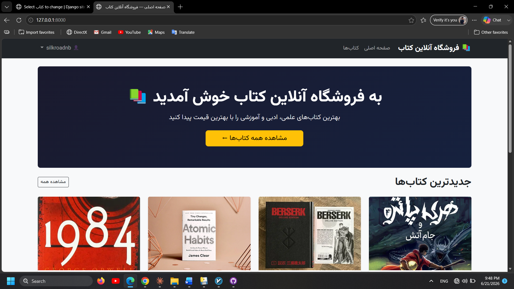
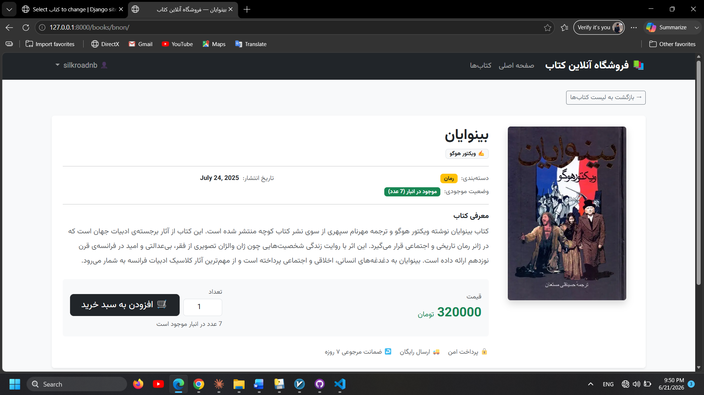
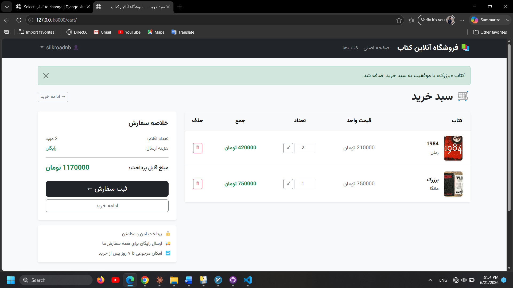
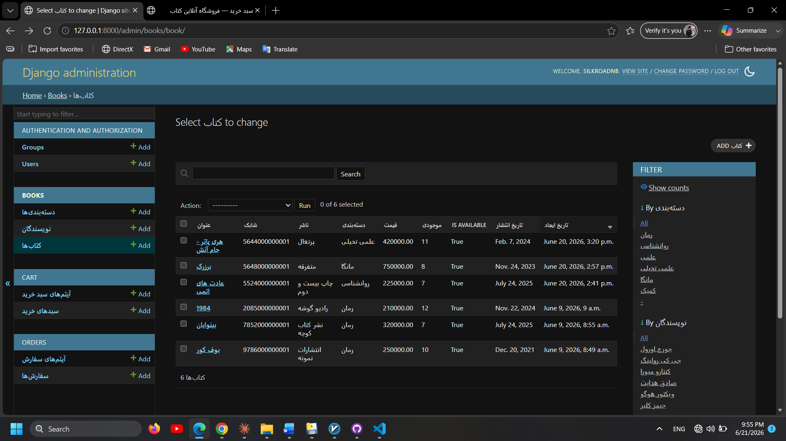

# 📚 Online Book Store Management System

<div align="center">


**A full-stack Persian-language online bookstore built with Django, featuring a complete purchase lifecycle from browsing to order tracking.**

[Features](#-features) • [Architecture](#-architecture) • [Database Design](#-database-design) • [Installation](#-installation) • [UML Diagrams](#-uml-documentation)

</div>

---

## 📖 Overview

This project is a fully functional **Online Book Store Management System** developed as a Software Engineering course project. It demonstrates end-to-end Django web development with a Persian (Farsi) RTL interface, covering user authentication, inventory management, shopping cart, and order processing.

The system is designed with a modular four-app architecture following Django best practices, documented with 10 UML diagrams covering all structural and behavioral aspects of the system.

---

## ✨ Features

### 🛍️ Customer Features
- Browse all books with cover images, prices, and availability status
- View detailed book pages with author and category information
- Register, log in, and log out securely
- Add books to a personal shopping cart with quantity selection
- Update quantities or remove items from the cart
- Place orders with a shipping address
- View full order history and individual order details

### 🔧 Admin Features
- Full Django Admin panel with Persian labels
- Manage books, categories, and authors (CRUD)
- View and manage all user carts and orders inline
- Filter orders by status; search books by title and author
- Update order status through its full lifecycle
- Auto-generated slugs for SEO-friendly URLs

### 🔒 Security Features
- CSRF protection on all forms
- Session-based authentication
- `LoginRequiredMixin` on all protected views
- Object-level ownership enforcement on orders
- Server-side input validation via Django forms
- Password hashing with Django's default PBKDF2 algorithm

---

## 🏗️ Architecture

The project follows Django's **MVT (Model-View-Template)** pattern with a clean four-module structure.

```
┌─────────────────────────────────────────────────────────┐
│                    Presentation Layer                   │
│           Bootstrap 5 RTL  │  Django Templates          │
└──────────────────────┬──────────────────────────────────┘
                       │ HTTP
┌──────────────────────▼──────────────────────────────────┐
│                  Business Logic Layer                   │
│  ┌──────────┐  ┌────────┐  ┌────────┐  ┌──────────┐   │
│  │ accounts │  │ books  │  │  cart  │  │  orders  │   │
│  └──────────┘  └────────┘  └────────┘  └──────────┘   │
│              Django ORM  │  URL Dispatcher              │
└──────────────────────┬──────────────────────────────────┘
                       │ SQL
┌──────────────────────▼──────────────────────────────────┐
│                      Data Layer                         │
│                SQLite  (→  PostgreSQL)                  │
└─────────────────────────────────────────────────────────┘
```

### App Responsibilities

| App | Models | Views | Responsibility |
|-----|--------|-------|----------------|
| `accounts` | User (built-in) | RegisterView, LoginView, LogoutView | Authentication & user management |
| `books` | Category, Author, Book | HomeView, BookListView, BookDetailView | Book catalogue & browsing |
| `cart` | Cart, CartItem | CartDetailView, AddToCartView, RemoveFromCartView, UpdateCartItemView | Shopping cart lifecycle |
| `orders` | Order, OrderItem | CheckoutView, OrderListView, OrderDetailView | Order placement & tracking |

### App Dependency Graph

```
accounts  ←  books  ←  cart  ←  orders
```

All dependencies are **unidirectional** — no circular imports between apps.

### Design Patterns Used

| Pattern | Where Applied |
|---------|--------------|
| **MVT** | Entire application — Django's core pattern |
| **Class-Based Views** | All views use CBVs with inheritance |
| **Mixin** | `LoginRequiredMixin` on Cart and Order views |
| **Factory / get_or_create** | Cart creation — one cart per user, created on first add |
| **Snapshot** | `unit_price` copied to `OrderItem` at purchase time |
| **Repository** | Django ORM as the data access layer |

---

## 🗄️ Database Design

### Models

```
┌──────────┐       ┌──────────────┐       ┌──────────┐
│   User   │──1:1──│     Cart     │──1:N──│ CartItem │
└──────────┘       └──────────────┘       └────┬─────┘
     │                                          │
     │ 1:N                                      │ N:1
     ▼                                          ▼
┌──────────┐       ┌──────────────┐       ┌──────────┐
│  Order   │──1:N──│  OrderItem   │──N:1──│   Book   │
└──────────┘       └──────────────┘       └────┬─────┘
                                               │ N:1    │ M:N
                                               ▼        ▼
                                         ┌──────────┐ ┌────────┐
                                         │ Category │ │ Author │
                                         └──────────┘ └────────┘
```

### Model Summary

| Model | Key Fields | Notes |
|-------|-----------|-------|
| `Category` | `name`, `slug` | Slug auto-generated on save |
| `Author` | `first_name`, `last_name`, `bio`, `photo` | |
| `Book` | `title`, `slug`, `price`, `stock`, `category` (FK), `authors` (M2M) | `is_available` property |
| `Cart` | `user` (OneToOne), `created_at` | `total_price` property |
| `CartItem` | `cart` (FK), `book` (FK), `quantity` | `unique_together=(cart, book)` |
| `Order` | `user` (FK), `status`, `total_price`, `shipping_address` | `is_cancellable` property |
| `OrderItem` | `order` (FK), `book` (FK), `quantity`, `unit_price` | Price snapshot at purchase time |

### Key Engineering Decisions

**OneToOne for Cart → User**
Enforces exactly one active cart per user at the database level. Prevents duplicate cart creation and simplifies `get_or_create` logic.

**`unit_price` snapshot on `OrderItem`**
Stores the book price at the moment of purchase. If a book's price changes in the future, historical order records remain accurate — a standard requirement in e-commerce systems.

**`unique_together = (cart, book)` on `CartItem`**
Prevents duplicate entries for the same book in a cart at the database constraint level. Adding an existing book increments quantity rather than creating a second row.

### Order Status Lifecycle

```
  ┌─────────┐    confirm    ┌───────────┐    ship    ┌─────────┐    deliver    ┌───────────┐
  │ pending │ ──────────►  │ confirmed │ ─────────► │ shipped │ ───────────►  │ delivered │
  └─────────┘               └───────────┘            └─────────┘               └───────────┘
       │                          │
       │ cancel                   │ cancel
       ▼                          ▼
  ┌───────────┐             ┌───────────┐
  │ cancelled │             │ cancelled │
  └───────────┘             └───────────┘
```

Cancellation is only permitted in `pending` and `confirmed` states, enforced via the `is_cancellable` property on the `Order` model.

---

## 🛠️ Technologies Used

| Layer | Technology | Version |
|-------|-----------|---------|
| Language | Python | 3.12+ |
| Framework | Django | 5.x |
| Database | SQLite | 3.x |
| Frontend | Bootstrap 5 RTL | 5.3.3 |
| Templating | Django Templates (Jinja2-style) | — |
| Admin | Django Admin (built-in) | — |
| Production DB (target) | PostgreSQL | — |
| Cache / Queue (target) | Redis | — |
| Web Server (target) | Nginx + Gunicorn | — |

---

## 📁 Project Structure

```
bookstore/
├── bookstore/                  # Project configuration
│   ├── settings.py
│   ├── urls.py                 # Root URL dispatcher
│   └── wsgi.py
│
├── accounts/                   # Authentication app
│   ├── forms.py                # UserRegistrationForm
│   ├── views.py                # RegisterView, LoginView, LogoutView
│   ├── urls.py                 # app_name = 'accounts'
│   ├── admin.py
│   └── templates/
│       └── accounts/
│           ├── register.html
│           └── login.html
│
├── books/                      # Book catalogue app
│   ├── models.py               # Category, Author, Book
│   ├── views.py                # HomeView, BookListView, BookDetailView
│   ├── urls.py                 # app_name = 'books'
│   ├── admin.py
│   └── templates/
│       └── books/
│           ├── home.html
│           ├── book_list.html
│           └── book_detail.html
│
├── cart/                       # Shopping cart app
│   ├── models.py               # Cart, CartItem
│   ├── views.py                # CartDetailView, AddToCartView, ...
│   ├── urls.py                 # app_name = 'cart'
│   ├── admin.py
│   └── templates/
│       └── cart/
│           └── cart_detail.html
│
├── orders/                     # Order management app
│   ├── models.py               # Order, OrderItem
│   ├── views.py                # CheckoutView, OrderListView, OrderDetailView
│   ├── urls.py                 # app_name = 'orders'
│   ├── admin.py
│   └── templates/
│       └── orders/
│           ├── checkout.html
│           ├── order_list.html
│           └── order_detail.html
│
├── templates/
│   └── base.html               # Global RTL base template
│
├── static/                     # Static files
├── media/                      # Uploaded images
├── manage.py
└── requirements.txt
```

---

## 🚀 Installation

### Prerequisites

- Python 3.12+
- pip
- virtualenv (recommended)

### Steps

```bash
# 1. Clone the repository
git clone https://github.com/alighafouri82/online-bookstore-django
cd bookstore

# 2. Create and activate a virtual environment
python -m venv venv
source venv/bin/activate        # Linux / macOS
venv\Scripts\activate           # Windows

# 3. Install dependencies
pip install -r requirements.txt

# 4. Apply database migrations
python manage.py migrate

# 5. Create a superuser for the admin panel
python manage.py createsuperuser

# 6. Run the development server
python manage.py runserver
```

The application will be available at `http://127.0.0.1:8000/`
Django Admin panel at `http://127.0.0.1:8000/admin/`

### Requirements

```
requirements.txt
```

---

## 🗺️ URL Reference

| URL | View | Access |
|-----|------|--------|
| `/` | HomeView | Public |
| `/books/` | BookListView | Public |
| `/books/<slug>/` | BookDetailView | Public |
| `/accounts/register/` | RegisterView | Guest only |
| `/accounts/login/` | LoginView | Guest only |
| `/accounts/logout/` | LogoutView | Authenticated |
| `/cart/` | CartDetailView | Authenticated |
| `/cart/add/<id>/` | AddToCartView | Authenticated |
| `/cart/remove/<id>/` | RemoveFromCartView | Authenticated |
| `/cart/update/<id>/` | UpdateCartItemView | Authenticated |
| `/orders/checkout/` | CheckoutView | Authenticated |
| `/orders/` | OrderListView | Authenticated |
| `/orders/<pk>/` | OrderDetailView | Authenticated |
| `/admin/` | Django Admin | Staff only |

---

## 📐 UML Documentation

This project includes 10 UML diagrams covering all structural and behavioral aspects of the system.

| # | Diagram | Purpose |
|---|---------|---------|
| 1 | **Use Case** | System actors (Guest, User, Admin) and their 22 use cases across 4 functional groups |
| 2 | **Class** | All 8 models with fields, properties, and relationships (associations, compositions, M2M) |
| 3 | **Sequence** | Message flow for two core scenarios: Add to Cart and Place Order |
| 4 | **Activity** | Full purchase workflow with Swimlanes for User, System, and Database |
| 5 | **Deployment** | Physical architecture: Nginx → Gunicorn → Django → PostgreSQL + Redis |
| 6 | **Component** | Three-layer architecture with interface dependencies between the four apps |
| 7 | **Package** | Django project package structure with import dependencies and framework inheritance |
| 8 | **Object** | Runtime snapshot with real instance values demonstrating the price snapshot pattern |
| 9 | **State** | Order lifecycle state machine with guard conditions (pending → delivered / cancelled) |
| 10 | **Timing** | 20-step timeline showing concurrent state changes across 6 system components during a purchase |

---

## 🔮 Future Improvements

### Technical
- [ ] **Payment gateway** — integrate with Iranian providers (Zarinpal / IDPay)
- [ ] **Async email** — order confirmation emails via Celery + Redis
- [ ] **REST API** — Django REST Framework for mobile app support
- [ ] **Full-text search** — Persian-aware search with Elasticsearch
- [ ] **Caching** — Redis cache for book listings and session management
- [ ] **Docker** — containerize for reproducible deployments
- [ ] **CI/CD** — automated testing and deployment pipeline
- [ ] **Test suite** — pytest-django with unit and integration tests
- [ ] **PostgreSQL** — migrate from SQLite for production
- [ ] **Race condition fix** — `select_for_update()` on stock check during checkout

### Features
- [ ] Book ratings and reviews
- [ ] Wishlist / saved books
- [ ] Discount codes and promotions
- [ ] Advanced filtering (price range, publication year, rating)
- [ ] User profile editing
- [ ] Book comparison

---

## 📸 Screenshots

>### Home Page



### Book List



### Shopping Cart



### Admin Panel



| Page | Description |
|------|-------------|
| `home.html` | Hero section + latest 8 books grid |
| `book_list.html` | Paginated book catalogue with availability badges |
| `book_detail.html` | Book detail with add-to-cart form |
| `cart_detail.html` | Cart with inline quantity editor and order summary |
| `checkout.html` | Checkout form with cart review |
| `order_detail.html` | Order confirmation with itemised receipt |
| Django Admin | Book/order management with inline items |

---

## 👤 Author

**[ Ali Ghafouri ]**

- GitHub: [@alighafouri82](https://github.com/alighafouri82)
- Email: alighafouri.82@gmail.com

---

## 📄 License

This project is licensed under the MIT License — see the [LICENSE](LICENSE) file for details.

---

<div align="center">
Built with ❤️ using Django | Software Engineering Course Project
</div>
